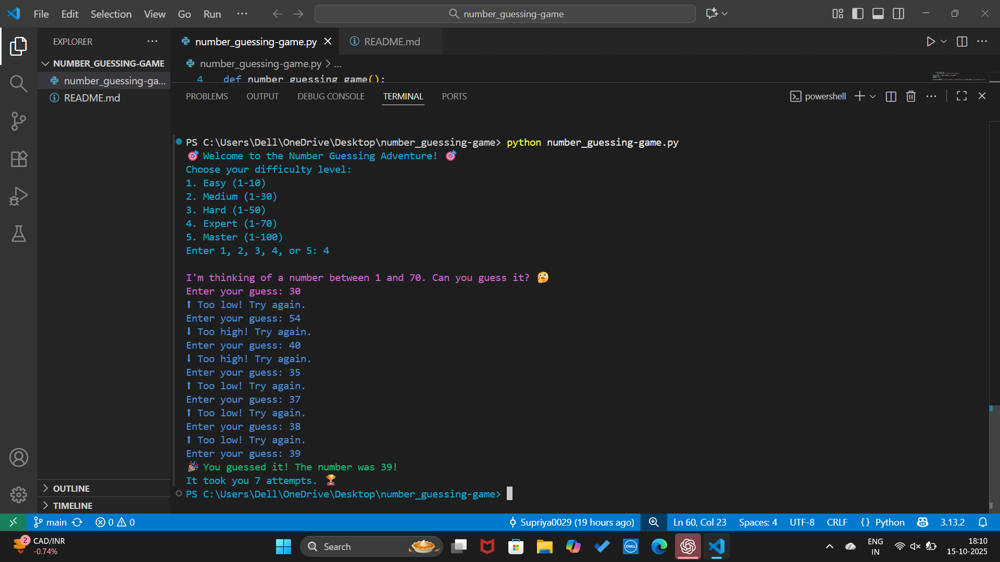

#  Number Guessing Game

This is a small Python project where the computer picks a random number, and the player tries to guess it.

##  How to Play
1. Run the Python file.
2. Enter your guesses.
3. The game will tell you if your guess is too high or too low.
4. Keep guessing until you win!

##  Requirements
- Python 3 must be installed on your computer

##  Output Screenshot
Here’s what the game looks like when you play it:

##  Author
Created by **Supriya Shahane**
